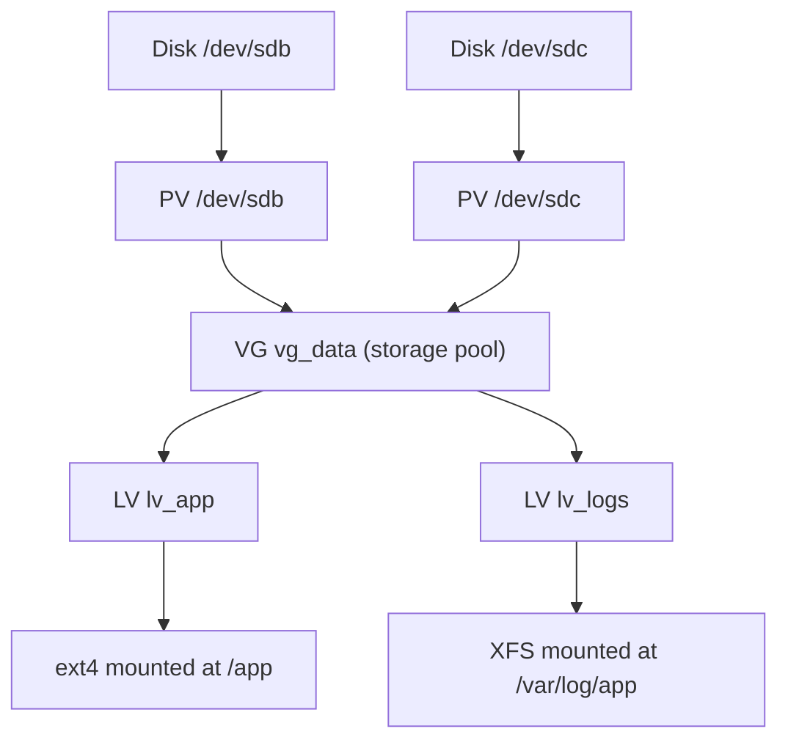
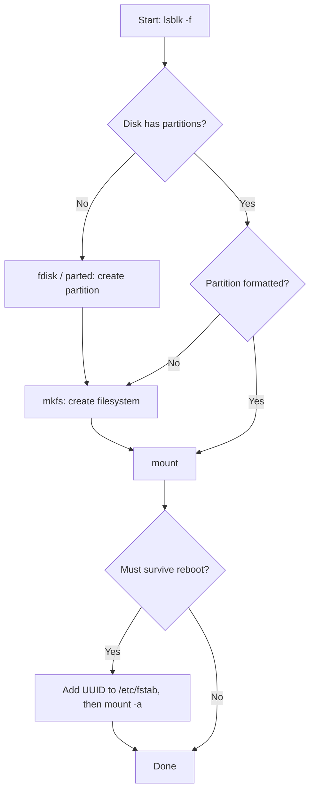

<div align="center">

# Linux Disk & Storage Management

**A structured reference and interview-preparation guide for DevOps, SRE, and Linux Administration roles**

Partitioning · Filesystems · Mounting · fstab · LVM · Swap · Troubleshooting · Interview Q&A

</div>

---

## About This Guide

This guide covers everything needed to manage storage on a Linux server, from identifying a new disk through to growing a production volume with zero downtime. It is organised into four parts so it works both as a **study guide** (read top to bottom) and a **quick reference** (jump to what you need).

| Part | What it covers | Use it when |
|------|----------------|-------------|
| [**Part 1 — Reference**](#part-1--reference) | Concepts and commands | Learning or looking up syntax |
| [**Part 2 — Workflows**](#part-2--workflows) | Step-by-step procedures | Doing real work or a hands-on lab |
| [**Part 3 — Troubleshooting**](#part-3--troubleshooting) | Symptom → cause → fix | Debugging an incident |
| [**Part 4 — Interview Preparation**](#part-4--interview-preparation) | 30 questions, rapid-fire revision, checklist | Preparing for interviews |

> [!WARNING]
> Partitioning and formatting commands are **destructive**. Always confirm the target device with `lsblk` before running `fdisk`, `parted`, `mkfs`, `wipefs`, or `pvcreate`. Practise on a virtual machine or a spare cloud volume.

---

## Table of Contents

**Part 1 — Reference**
- [1.1 Core Concepts](#11-core-concepts)
- [1.2 Command Cheat Sheet](#12-command-cheat-sheet)
- [1.3 Viewing Disk Information](#13-viewing-disk-information)
- [1.4 Partition Management](#14-partition-management)
- [1.5 Filesystems: ext4 vs XFS](#15-filesystems-ext4-vs-xfs)
- [1.6 Mounting and Unmounting](#16-mounting-and-unmounting)
- [1.7 Persistent Mounts with /etc/fstab](#17-persistent-mounts-with-etcfstab)
- [1.8 Logical Volume Management (LVM)](#18-logical-volume-management-lvm)
- [1.9 Swap Management](#19-swap-management)

**Part 2 — Workflows**
- [2.1 Choosing the Right Tool](#21-choosing-the-right-tool)
- [2.2 Add a New Disk (Standard Partition)](#22-add-a-new-disk-standard-partition)
- [2.3 Add a New Disk (LVM)](#23-add-a-new-disk-lvm)
- [2.4 Extend a Volume Online](#24-extend-a-volume-online)
- [2.5 Grow a Resized Cloud Volume](#25-grow-a-resized-cloud-volume)
- [2.6 Replace a Disk in LVM Without Downtime](#26-replace-a-disk-in-lvm-without-downtime)

**Part 3 — Troubleshooting**
- [3.1 Troubleshooting Matrix](#31-troubleshooting-matrix)
- [3.2 Diagnostic Commands](#32-diagnostic-commands)

**Part 4 — Interview Preparation**
- [4.1 How to Answer Troubleshooting Questions](#41-how-to-answer-troubleshooting-questions)
- [4.2 Fundamentals (Q1–Q8)](#42-fundamentals)
- [4.3 Intermediate (Q9–Q17)](#43-intermediate)
- [4.4 Advanced (Q18–Q27)](#44-advanced)
- [4.5 Scenario and Design (Q28–Q30)](#45-scenario-and-design)
- [4.6 Rapid-Fire Revision](#46-rapid-fire-revision)
- [4.7 Common Mistakes to Avoid](#47-common-mistakes-to-avoid)
- [4.8 Last-Minute Checklist](#48-last-minute-checklist)

[References](#references)

---

# Part 1 — Reference

## 1.1 Core Concepts

### The storage stack

Every piece of storage on Linux is built in layers. Most commands in this guide operate on exactly one layer, so knowing the stack tells you which tool to reach for.

```
┌──────────────────────────────┐
│  Mount point   (/data)       │  ← mount, umount, /etc/fstab
├──────────────────────────────┤
│  Filesystem    (ext4, XFS)   │  ← mkfs, resize2fs, xfs_growfs, fsck
├──────────────────────────────┤
│  Logical Volume (optional)   │  ← pvcreate, vgcreate, lvcreate, lvextend
├──────────────────────────────┤
│  Partition     (/dev/sdb1)   │  ← fdisk, parted, growpart
├──────────────────────────────┤
│  Disk          (/dev/sdb)    │  ← lsblk, hardware / cloud volume
└──────────────────────────────┘
```

### Key terms

| Term | Definition |
|------|------------|
| **Block device** | A device that reads and writes data in fixed-size blocks — disks, partitions, logical volumes. Found under `/dev`. |
| **Partition** | A contiguous region of a disk recorded in the partition table, e.g. `/dev/sdb1`. |
| **Partition table** | Metadata describing a disk's partitions. Either **MBR** (legacy) or **GPT** (modern). |
| **Filesystem** | The on-disk structure that organises files and directories (ext4, XFS). Created with `mkfs`. |
| **Mount point** | An existing directory where a filesystem is attached to the directory tree. |
| **UUID** | A unique identifier stored in the filesystem. Stable across reboots, unlike `/dev/sdX` names. |
| **Inode** | A metadata record for a file: permissions, owner, timestamps, and pointers to data blocks. Every file consumes one. |

### Device naming

| Pattern | Typical source |
|---------|----------------|
| `/dev/sda`, `/dev/sdb1` | SATA, SAS, SCSI, and USB disks |
| `/dev/nvme0n1`, `/dev/nvme0n1p1` | NVMe drives — note the `p` before the partition number |
| `/dev/vda`, `/dev/xvda` | Virtual disks (KVM virtio, Xen, older AWS instances) |
| `/dev/mapper/vg-lv`, `/dev/vg/lv` | LVM logical volumes (device-mapper) |
| `/dev/md0` | Software RAID (mdadm) |

### MBR vs GPT

| Feature | MBR | GPT |
|---------|-----|-----|
| Maximum disk size | 2 TiB | Effectively unlimited (~9.4 ZB) |
| Maximum partitions | 4 primary (or 3 primary + extended with logical) | 128 by default |
| Redundancy | Single copy in sector 0 | Primary header plus backup at end of disk, CRC-checked |
| Boot firmware | Legacy BIOS | UEFI (BIOS via a BIOS boot partition) |
| **Recommendation** | Legacy systems only | **Default choice for new disks** |

<p align="right"><a href="#table-of-contents">Back to top</a></p>

---

## 1.2 Command Cheat Sheet

### Viewing disk information

| Command | Purpose |
|---------|---------|
| `lsblk` | Display block devices as a tree |
| `lsblk -f` | Add filesystem type, label, UUID, and mount point |
| `fdisk -l` | List partition tables for all disks |
| `blkid` | Show UUIDs and filesystem types |
| `df -h` | Filesystem space usage in human-readable units |
| `df -i` | Filesystem inode usage |
| `du -sh /path` | Total size of a directory |
| `findmnt` | Show mounted filesystems as a tree |

### Partition management

| Command | Purpose |
|---------|---------|
| `fdisk /dev/sdX` | Create and manage partitions interactively (MBR and GPT) |
| `parted /dev/sdX` | Alternative partitioning tool, scriptable, suited to automation |
| `partprobe /dev/sdX` | Ask the kernel to re-read the partition table |
| `mkfs.ext4 /dev/sdX1` | Format a partition as ext4 |
| `mkfs.xfs /dev/sdX1` | Format a partition as XFS |
| `wipefs -a /dev/sdX` | Remove filesystem, RAID, and partition-table signatures |

### Mounting and unmounting

| Command | Purpose |
|---------|---------|
| `mount /dev/sdX1 /mnt` | Mount a partition |
| `umount /mnt` | Unmount a partition |
| `mount -o remount,rw /mnt` | Remount a filesystem read-write |
| `mount -a` | Mount all entries in `/etc/fstab` — use to test fstab |

### Logical Volume Management

| Command | Purpose |
|---------|---------|
| `pvcreate /dev/sdX` | Create a physical volume |
| `vgcreate vg_name /dev/sdX` | Create a volume group |
| `lvcreate -L 10G -n lv_name vg_name` | Create a logical volume |
| `lvextend -r -L +5G /dev/vg_name/lv_name` | Grow a logical volume **and** its filesystem |
| `pvs` · `vgs` · `lvs` | Summaries of physical volumes, volume groups, logical volumes |

### Swap management

| Command | Purpose |
|---------|---------|
| `mkswap /dev/sdX1` | Initialise a swap partition or file |
| `swapon /dev/sdX1` | Enable swap space |
| `swapoff /dev/sdX1` | Disable swap space |
| `swapon --show` | List active swap |

<p align="right"><a href="#table-of-contents">Back to top</a></p>

---

## 1.3 Viewing Disk Information

### `lsblk` — list block devices

```bash
lsblk
lsblk -f                                   # include FSTYPE, LABEL, UUID, MOUNTPOINTS
lsblk -o NAME,SIZE,TYPE,FSTYPE,MOUNTPOINT  # custom columns
```

**Example output**

```
NAME   MAJ:MIN RM  SIZE RO TYPE MOUNTPOINT
sda      8:0    0  100G  0 disk
├─sda1   8:1    0   96G  0 part /
└─sda2   8:2    0    4G  0 part [SWAP]
sdb      8:16   0   20G  0 disk
```

**How to read it**
- `sda` is an existing disk, already partitioned and in use.
- `sdb` is a new disk with no partitions — ready to be set up.

### `fdisk -l` — partition details

```bash
sudo fdisk -l            # all disks
sudo fdisk -l /dev/sdb   # a single disk
```

### `blkid` — UUIDs and filesystem types

```bash
sudo blkid
sudo blkid /dev/sdb1
```

### `df` — filesystem space

```bash
df -h     # space usage
df -hT    # include filesystem type
df -i     # inode usage
```

> [!TIP]
> A filesystem can report **"No space left on device"** while `df -h` shows free space. This means inodes are exhausted. Always check `df -i` as well.

### `du` — directory size

```bash
du -sh /var/log                                  # total size of one directory
du -h --max-depth=1 /var | sort -hr | head       # largest subdirectories
du -xh / --max-depth=1 2>/dev/null               # -x stays on one filesystem
```

### `findmnt` — what is mounted where

```bash
findmnt              # full mount tree
findmnt /data        # a single mount point
findmnt --verify     # validate /etc/fstab
```

<p align="right"><a href="#table-of-contents">Back to top</a></p>

---

## 1.4 Partition Management

### Creating a partition with `fdisk`

```bash
sudo fdisk /dev/sdb
```

| Key | Action |
|-----|--------|
| `m` | Show help |
| `p` | Print the partition table |
| `g` | Create a new empty **GPT** partition table |
| `o` | Create a new empty **MBR (DOS)** partition table |
| `n` | Create a new partition |
| `t` | Change partition type (e.g. `lvm`, `swap`) |
| `d` | Delete a partition |
| `w` | **Write** changes and exit |
| `q` | Quit **without** saving |

> [!NOTE]
> `fdisk` makes no changes until you press `w`. If you make a mistake, press `q` to exit safely.

After writing, confirm the kernel sees the new partition:

```bash
sudo partprobe /dev/sdb   # only if the partition does not appear
lsblk
```

### Creating a partition with `parted` (scriptable)

```bash
sudo parted /dev/sdb --script mklabel gpt
sudo parted /dev/sdb --script mkpart primary ext4 0% 100%
sudo parted /dev/sdb print
```

> [!TIP]
> Modern `fdisk` fully supports GPT. Prefer `parted` when you need a **non-interactive** command for scripts, automation, or configuration management.

### Formatting a partition

```bash
sudo mkfs.ext4 /dev/sdb1              # ext4
sudo mkfs.xfs  /dev/sdb1              # XFS
sudo mkfs.ext4 -L data /dev/sdb1      # ext4 with a label
```

<p align="right"><a href="#table-of-contents">Back to top</a></p>

---

## 1.5 Filesystems: ext4 vs XFS

| Feature | ext4 | XFS |
|---------|------|-----|
| Default on | Ubuntu, Debian | RHEL, Rocky, AlmaLinux, Amazon Linux 2023 |
| Grow while mounted | Yes — `resize2fs` | Yes — `xfs_growfs <mount-point>` |
| Shrink | Yes, **offline only** | **Not supported** |
| Strengths | General purpose, mature, flexible | Large files, parallel I/O, very large filesystems |
| Inode allocation | Fixed at creation time | Dynamic |
| Repair tool | `e2fsck` / `fsck.ext4` | `xfs_repair` |
| Reserved space | 5% for root by default (`tune2fs -m`) | None |

> [!IMPORTANT]
> `resize2fs` takes the **device** (`/dev/vg/lv`). `xfs_growfs` takes the **mount point** (`/data`). Mixing these up is a common interview slip.

<p align="right"><a href="#table-of-contents">Back to top</a></p>

---

## 1.6 Mounting and Unmounting

### Mount

```bash
sudo mkdir -p /mnt/mydisk
sudo mount /dev/sdb1 /mnt/mydisk
sudo mount -o ro,noatime /dev/sdb1 /mnt/mydisk   # with options
```

### Unmount

```bash
sudo umount /mnt/mydisk
```

If the unmount fails with **`target is busy`**:

```bash
sudo lsof +f -- /mnt/mydisk     # processes holding files open
sudo fuser -vm /mnt/mydisk      # processes using the mount
cd ~                            # make sure your own shell is not inside it
```

### Remount

```bash
sudo mount -o remount,rw /mnt/mydisk
sudo mount -o remount,ro /mnt/mydisk
```

### Common mount options

| Option | Effect |
|--------|--------|
| `defaults` | `rw, suid, dev, exec, auto, nouser, async` |
| `ro` / `rw` | Read-only / read-write |
| `noatime` | Do not update access times on read — reduces write I/O |
| `nofail` | Do not fail the boot if the device is missing |
| `noexec` | Prevent execution of binaries (common for `/tmp`) |
| `nosuid` | Ignore set-user-ID bits |

<p align="right"><a href="#table-of-contents">Back to top</a></p>

---

## 1.7 Persistent Mounts with `/etc/fstab`

Mounts created with the `mount` command **do not survive a reboot**. To make them permanent, add them to `/etc/fstab`.

**Step 1 — Get the UUID**

```bash
sudo blkid /dev/sdb1
# /dev/sdb1: UUID="3f1c...e9a2" TYPE="ext4"
```

**Step 2 — Add the entry**

```fstab
# <device>             <mount point>  <type>  <options>          <dump>  <pass>
UUID=3f1c...e9a2       /data          ext4    defaults,nofail    0       2
/dev/vg_data/lv_app    /app           xfs     defaults           0       0
/swapfile              none           swap    sw                 0       0
```

**Step 3 — Test before rebooting**

```bash
sudo findmnt --verify
sudo mount -a
```

### Field reference

| Field | Meaning |
|-------|---------|
| **device** | Prefer `UUID=` or `LABEL=`; `/dev/sdX` names can change between boots |
| **mount point** | Target directory, or `none` for swap |
| **type** | `ext4`, `xfs`, `swap`, `nfs`, etc. |
| **options** | Comma-separated mount options (see [1.6](#common-mount-options)) |
| **dump** | Legacy backup flag — almost always `0` |
| **pass** | fsck order at boot: `1` = root, `2` = others, `0` = skip |

> [!CAUTION]
> A bad fstab entry can drop the system into **emergency mode** at boot. Always run `mount -a` after editing, and use `nofail` for non-critical, removable, or cloud volumes.

<p align="right"><a href="#table-of-contents">Back to top</a></p>

---

## 1.8 Logical Volume Management (LVM)

LVM adds a flexible layer between physical disks and filesystems. It lets you resize volumes online, pool multiple disks, move data between disks without downtime, and take snapshots.



| Layer | What it is | Commands |
|-------|-----------|----------|
| **PV** — Physical Volume | A disk or partition initialised for LVM | `pvcreate`, `pvs`, `pvdisplay`, `pvresize`, `pvmove` |
| **VG** — Volume Group | A pool of storage built from one or more PVs | `vgcreate`, `vgs`, `vgextend`, `vgreduce` |
| **LV** — Logical Volume | A virtual block device carved from a VG; formatted and mounted | `lvcreate`, `lvs`, `lvextend`, `lvreduce` |
| **PE** — Physical Extent | The allocation unit (4 MiB by default) | — |

### Create

```bash
sudo pvcreate /dev/sdb /dev/sdc
sudo vgcreate vg_data /dev/sdb /dev/sdc
sudo lvcreate -L 10G -n lv_app vg_data          # fixed size
sudo lvcreate -l 100%FREE -n lv_logs vg_data    # all remaining space
```

### Format and mount

```bash
sudo mkfs.ext4 /dev/vg_data/lv_app
sudo mkdir -p /app
sudo mount /dev/vg_data/lv_app /app
```

### Inspect

```bash
sudo pvs; sudo vgs; sudo lvs                     # summaries
sudo pvdisplay; sudo vgdisplay; sudo lvdisplay   # detail
```

### Extend (online)

```bash
sudo lvextend -r -L +5G /dev/vg_data/lv_app      # -r also grows the filesystem
```

Manual equivalent:

```bash
sudo lvextend -L +5G /dev/vg_data/lv_app
sudo resize2fs /dev/vg_data/lv_app               # ext4
sudo xfs_growfs /app                             # XFS
```

### Shrink (ext4 only, offline)

```bash
sudo umount /app
sudo lvreduce -r -L 8G /dev/vg_data/lv_app       # -r checks and shrinks the FS first
sudo mount /app
```

> [!CAUTION]
> Never shrink the logical volume **before** the filesystem — this destroys data. `lvreduce -r` performs the steps in the correct order. XFS cannot be shrunk at all.

### Snapshots

```bash
sudo lvcreate -s -L 2G -n lv_app_snap /dev/vg_data/lv_app   # create
sudo lvconvert --merge /dev/vg_data/lv_app_snap             # roll back to snapshot
sudo lvremove /dev/vg_data/lv_app_snap                      # discard snapshot, keep changes
```

<p align="right"><a href="#table-of-contents">Back to top</a></p>

---

## 1.9 Swap Management

### Swap partition

```bash
sudo mkswap /dev/sdb2
sudo swapon /dev/sdb2
swapon --show
free -h
```

### Swap file (common on cloud VMs)

```bash
sudo fallocate -l 2G /swapfile        # or: sudo dd if=/dev/zero of=/swapfile bs=1M count=2048
sudo chmod 600 /swapfile
sudo mkswap /swapfile
sudo swapon /swapfile
echo '/swapfile none swap sw 0 0' | sudo tee -a /etc/fstab
```

### Disable swap

```bash
sudo swapoff /dev/sdb2    # one device
sudo swapoff -a           # all swap
```

### Tune swappiness

```bash
cat /proc/sys/vm/swappiness                                        # current value (often 60)
sudo sysctl vm.swappiness=10                                       # runtime change
echo 'vm.swappiness=10' | sudo tee /etc/sysctl.d/99-swappiness.conf # persistent
```

<p align="right"><a href="#table-of-contents">Back to top</a></p>

---

# Part 2 — Workflows

## 2.1 Choosing the Right Tool

**Always start by checking what exists:**

```bash
lsblk -f
```

| Situation | What to do |
|-----------|-----------|
| Disk is brand new, no partitions | `fdisk` or `parted` → `mkfs` → `mount` |
| Partition exists but has no filesystem | `mkfs` → `mount` |
| Partition exists and is formatted | `mount` only |
| Mount must survive reboot | Add UUID to `/etc/fstab` → `mount -a` |
| Storage will need to grow later | Use LVM |



<p align="right"><a href="#table-of-contents">Back to top</a></p>

---

## 2.2 Add a New Disk (Standard Partition)

```bash
# 1. Identify the new disk
lsblk

# 2. Create a partition (inside fdisk: g → n → accept defaults → w)
sudo fdisk /dev/sdb

# 3. Create the filesystem
sudo mkfs.ext4 /dev/sdb1

# 4. Mount it
sudo mkdir -p /data
sudo mount /dev/sdb1 /data

# 5. Make it permanent
echo "UUID=$(sudo blkid -s UUID -o value /dev/sdb1) /data ext4 defaults,nofail 0 2" | sudo tee -a /etc/fstab
sudo umount /data && sudo mount -a

# 6. Verify
df -hT /data
```

## 2.3 Add a New Disk (LVM)

```bash
# 1. Partition and flag for LVM
sudo parted /dev/sdb --script mklabel gpt mkpart primary 0% 100% set 1 lvm on

# 2. Build the LVM stack
sudo pvcreate /dev/sdb1
sudo vgcreate vg_data /dev/sdb1
sudo lvcreate -L 15G -n lv_data vg_data

# 3. Filesystem, mount, persist
sudo mkfs.xfs /dev/vg_data/lv_data
sudo mkdir -p /data
echo '/dev/vg_data/lv_data /data xfs defaults,nofail 0 0' | sudo tee -a /etc/fstab
sudo mount -a

# 4. Verify
df -hT /data
```

## 2.4 Extend a Volume Online

```bash
# 1. Check free space in the volume group
sudo vgs

# 2. If there is none, add a disk to the pool
sudo pvcreate /dev/sdd
sudo vgextend vg_data /dev/sdd

# 3. Grow the LV and filesystem together
sudo lvextend -r -L +20G /dev/vg_data/lv_data

# 4. Verify
df -h /data
```

## 2.5 Grow a Resized Cloud Volume

After enlarging a cloud disk (e.g. AWS EBS, Azure Managed Disk), the operating system still sees the old size until each layer is grown.

```bash
lsblk                                         # disk is larger; partition is not

sudo growpart /dev/nvme0n1 1                  # grow partition 1

# If the partition is an LVM PV:
sudo pvresize /dev/nvme0n1p1
sudo lvextend -r -l +100%FREE /dev/vg/root

# If it is a plain filesystem:
sudo resize2fs /dev/nvme0n1p1                 # ext4
sudo xfs_growfs /                             # XFS
```

## 2.6 Replace a Disk in LVM Without Downtime

```bash
sudo pvcreate /dev/sdnew
sudo vgextend vg_data /dev/sdnew
sudo pvmove /dev/sdold /dev/sdnew     # moves data online; resumable if interrupted
sudo vgreduce vg_data /dev/sdold
sudo pvremove /dev/sdold
```

<p align="right"><a href="#table-of-contents">Back to top</a></p>

---

# Part 3 — Troubleshooting

## 3.1 Troubleshooting Matrix

| Symptom | Investigate with | Likely cause and fix |
|---------|------------------|----------------------|
| "No space left on device" but `df -h` shows free space | `df -i` | Inodes exhausted — remove large numbers of small files (sessions, cache, mail queue) |
| `df` shows full, `du` shows much less | `lsof +L1` | Deleted files still held open — restart the process or truncate via `/proc/<pid>/fd/<n>` |
| Space "missing" after a mount | Unmount and inspect the directory | Data written before mounting is hidden underneath the mount point |
| Filesystem became read-only | `dmesg -T`, `journalctl -k` | Kernel remounted read-only after I/O errors — check hardware, unmount, run `fsck` / `xfs_repair` |
| `umount: target is busy` | `lsof +f -- /mnt`, `fuser -vm /mnt` | A process or shell is using it — stop it; `umount -l` only as a last resort |
| Boot drops to emergency mode | `journalctl -xb` | Bad `/etc/fstab` entry — fix UUID or type, add `nofail` |
| New partition not visible | `lsblk` | Kernel has not re-read the table — `partprobe /dev/sdX` |
| Cloud disk resized but filesystem unchanged | `lsblk` | Grow each layer — `growpart` → `pvresize` → `lvextend -r` or `resize2fs` / `xfs_growfs` |
| Slow disk, high I/O wait | `iostat -x 1`, `iotop`, `vmstat 1` | Check latency (`await`), saturation, noisy processes, cloud IOPS limits |

## 3.2 Diagnostic Commands

| Command | What it tells you |
|---------|-------------------|
| `lsblk -f` | Full device tree with filesystems and UUIDs |
| `df -hT` / `df -i` | Space and inode usage per filesystem |
| `du -xh / --max-depth=1 \| sort -hr` | Largest directories on one filesystem |
| `lsof +L1` | Deleted files still held open |
| `findmnt --verify` | Problems in `/etc/fstab` |
| `dmesg -T \| tail -50` | Recent kernel messages, including disk errors |
| `iostat -x 1` | Per-device latency, queue size, utilisation |
| `iotop` / `pidstat -d 1` | Which processes are doing I/O |
| `smartctl -a /dev/sdX` | Physical disk health (SMART) |

<p align="right"><a href="#table-of-contents">Back to top</a></p>

---

# Part 4 — Interview Preparation

Each question includes a **short answer** you can say in 15–30 seconds, followed by a **detailed answer** to use when the interviewer probes further. Click a question to expand it.

## 4.1 How to Answer Troubleshooting Questions

Interviewers care as much about your *approach* as your answer. Structure scenario answers in five steps:

| Step | What to say |
|------|-------------|
| **1. Clarify** | Scope and impact — one server or many? Production? When did it start? |
| **2. Observe** | The first commands you would run and what you expect to see |
| **3. Isolate** | Narrow down the layer: disk, partition, LVM, filesystem, mount, or application |
| **4. Mitigate and fix** | Restore service safely first, then fix the root cause |
| **5. Prevent** | Monitoring, alerting, automation, or configuration changes so it doesn't recur |

---

## 4.2 Fundamentals

<details>
<summary><b>Q1. What is the difference between a disk, a partition, and a filesystem?</b></summary>

<br>

**Short answer:** A disk is the physical or virtual device, a partition is a defined region of that disk, and a filesystem is the structure written onto the partition that organises files.

**Detailed answer:**
- **Disk** — the block device, e.g. `/dev/sdb`.
- **Partition** — a region of the disk recorded in the partition table, e.g. `/dev/sdb1`.
- **Filesystem** — created with `mkfs`; defines how files, directories, and metadata are stored (ext4, XFS).

A filesystem can sit directly on a whole disk or LVM volume without a partition, but partitioning is conventional because tools and humans expect it.

</details>

<details>
<summary><b>Q2. What is the difference between <code>df</code> and <code>du</code>?</b></summary>

<br>

**Short answer:** `df` asks the filesystem how many blocks are used; `du` walks the directory tree and adds up file sizes it can see.

**Detailed answer:** They disagree when:
- Files are deleted but still held open by a process.
- Data is hidden underneath a mount point.
- ext4 reserves blocks for root (5% by default).
- `du` cannot read some directories due to permissions.

</details>

<details>
<summary><b>Q3. MBR or GPT — which would you choose, and why?</b></summary>

<br>

**Short answer:** GPT, for any modern system. MBR is limited to 2 TiB and four primary partitions.

**Detailed answer:** GPT supports very large disks and 128 partitions by default, stores a backup header at the end of the disk, and uses CRC checksums to detect corruption. It is required for UEFI boot. MBR is only appropriate for legacy BIOS systems.

</details>

<details>
<summary><b>Q4. Why use UUIDs in <code>/etc/fstab</code> instead of <code>/dev/sdb1</code>?</b></summary>

<br>

**Short answer:** Device names can change between boots; UUIDs belong to the filesystem and stay stable.

**Detailed answer:** Kernel names are assigned in discovery order and can shift after adding or removing disks, changing controllers, or on cloud instances where NVMe ordering varies. Mounting the wrong device at boot can cause a failed boot or data corruption.

</details>

<details>
<summary><b>Q5. Explain each field in an <code>/etc/fstab</code> entry.</b></summary>

<br>

**Short answer:** Device, mount point, filesystem type, options, dump, and fsck pass order.

**Detailed answer:**

| Field | Example | Meaning |
|-------|---------|---------|
| device | `UUID=3f1c...` | What to mount |
| mount point | `/data` | Where to mount it (`none` for swap) |
| type | `ext4` | Filesystem type |
| options | `defaults,nofail` | Mount options |
| dump | `0` | Legacy backup flag |
| pass | `2` | fsck order: 1 = root, 2 = others, 0 = skip |

</details>

<details>
<summary><b>Q6. What is an inode, and can you run out of them?</b></summary>

<br>

**Short answer:** An inode stores a file's metadata. Yes — on ext4 you can run out of inodes while disk space remains.

**Detailed answer:** An inode holds a file's type, permissions, owner, timestamps, link count, and pointers to data blocks — but not its name, which lives in the directory entry. ext4 fixes the inode count at `mkfs` time, so millions of tiny files can exhaust inodes. Check with `df -i`. XFS allocates inodes dynamically and is much less prone to this.

</details>

<details>
<summary><b>Q7. What does <code>mount -a</code> do, and why run it before rebooting?</b></summary>

<br>

**Short answer:** It mounts every fstab entry not already mounted — a safe way to test fstab changes.

**Detailed answer:** Running it after editing `/etc/fstab` surfaces typos, wrong UUIDs, and wrong filesystem types immediately, rather than at boot, where they can send the server into emergency mode. `findmnt --verify` is a complementary static check.

</details>

<details>
<summary><b>Q8. What happens to existing files in a directory when you mount something on top of it?</b></summary>

<br>

**Short answer:** They are hidden, not deleted, until the filesystem is unmounted.

**Detailed answer:** This is a classic cause of "the disk is full but I can't find the files" — for example, an application writes logs to `/data` before the volume is mounted. To inspect hidden data without unmounting, bind-mount the parent elsewhere: `mount --bind / /mnt/root` and look in `/mnt/root/data`.

</details>

<p align="right"><a href="#table-of-contents">Back to top</a></p>

---

## 4.3 Intermediate

<details>
<summary><b>Q9. Walk through adding a new disk and making it permanently available at <code>/data</code>.</b></summary>

<br>

**Short answer:** Identify with `lsblk`, partition, format, mount, add the UUID to fstab, and test with `mount -a`.

**Detailed answer:**
1. `lsblk` — confirm the device, size, and that it is unused.
2. `fdisk /dev/sdb` or `parted` — create a GPT table and partition.
3. `mkfs.xfs /dev/sdb1` (or ext4).
4. `mkdir /data && mount /dev/sdb1 /data`.
5. `blkid /dev/sdb1` → add `UUID=... /data xfs defaults,nofail 0 0` to `/etc/fstab`.
6. `umount /data && mount -a` to prove fstab works.
7. Set ownership and permissions for the application.

**Bonus point:** In production, put it under LVM so it can be grown later without downtime.

</details>

<details>
<summary><b>Q10. Explain LVM architecture. Why use it?</b></summary>

<br>

**Short answer:** Physical volumes are pooled into a volume group, from which logical volumes are carved. It makes storage flexible — resize online, span disks, snapshot, and migrate.

**Detailed answer:**
- **PV** — a disk or partition initialised for LVM.
- **VG** — a pool combining one or more PVs.
- **LV** — a virtual block device from the pool; this is what you format and mount.
- Space is allocated in extents (4 MiB by default).

**Benefits:** online resizing, spanning disks, adding capacity without downtime, live data migration with `pvmove`, snapshots.
**Trade-offs:** added complexity; a VG spanning disks without RAID fails if any one disk fails.

</details>

<details>
<summary><b>Q11. A logical volume is 95% full. How do you grow it with zero downtime?</b></summary>

<br>

**Short answer:** Check VG free space, add a disk with `vgextend` if needed, then `lvextend -r`.

**Detailed answer:**
1. `vgs` — check free space.
2. If none: attach a disk, `pvcreate /dev/sdd`, `vgextend vg /dev/sdd`.
3. `lvextend -r -L +20G /dev/vg/lv` — the `-r` flag grows the filesystem too.
   - Manual alternative: `resize2fs /dev/vg/lv` (ext4) or `xfs_growfs /mountpoint` (XFS).
4. Confirm with `df -h`.

Both ext4 and XFS can grow while mounted.

</details>

<details>
<summary><b>Q12. Can you shrink an XFS filesystem? What about ext4?</b></summary>

<br>

**Short answer:** XFS — no. ext4 — yes, but only while unmounted.

**Detailed answer:**
- **XFS:** only growth is supported. To shrink, back up, recreate a smaller volume and filesystem, and restore.
- **ext4:** unmount, `e2fsck -f`, `resize2fs` to the smaller size, **then** `lvreduce`. Or use `lvreduce -r -L <size>`, which does this in the correct order.

Shrinking the logical volume before the filesystem destroys data.

</details>

<details>
<summary><b>Q13. ext4 vs XFS — how do you choose?</b></summary>

<br>

**Short answer:** Follow the distribution default unless there is a specific need. Choose ext4 if you may need to shrink; XFS for large files and high parallel I/O.

**Detailed answer:** XFS is the RHEL default, scales well for very large filesystems and parallel workloads, and allocates inodes dynamically — but cannot shrink. ext4 is the Debian/Ubuntu default, well-rounded, and supports offline shrinking.

</details>

<details>
<summary><b>Q14. <code>umount</code> fails with "target is busy". What do you do?</b></summary>

<br>

**Short answer:** Find the process holding it with `lsof` or `fuser`, stop it gracefully, and retry.

**Detailed answer:**
1. Make sure your own shell isn't inside the directory (`cd /`).
2. `lsof +f -- /data` or `fuser -vm /data`.
3. Stop the service cleanly (`systemctl stop app`).
4. Retry `umount`.
5. Last resorts: `fuser -km /data` (kills processes) or `umount -l` (lazy unmount). Avoid lazy unmount before removing a disk — I/O may still be in flight.

</details>

<details>
<summary><b>Q15. Swap partition vs swap file — what are the trade-offs?</b></summary>

<br>

**Short answer:** Performance is nearly identical today; swap files are easier to create and resize, which suits cloud VMs.

**Detailed answer:** A swap file can be added, resized, or removed without repartitioning. It must be `chmod 600`. Some filesystems (e.g. Btrfs) need extra steps for swap files. Swap partitions remain common in traditional and hibernation setups.

</details>

<details>
<summary><b>Q16. What is <code>vm.swappiness</code>?</b></summary>

<br>

**Short answer:** A kernel setting controlling how aggressively the kernel swaps application memory versus dropping page cache.

**Detailed answer:** The default is usually 60. Lower values (e.g. 10) keep application memory in RAM longer, common for databases. A value of 0 does not disable swap; it minimises swapping. Set at runtime with `sysctl` and persist in `/etc/sysctl.d/`.

</details>

<details>
<summary><b>Q17. How do you make a new partition or disk visible without rebooting?</b></summary>

<br>

**Short answer:** `partprobe /dev/sdX` for a new partition; rescan the SCSI bus for a newly attached disk.

**Detailed answer:**
- New partition: `partprobe /dev/sdX` or `partx -u /dev/sdX`. This can fail if other partitions on the disk are in use.
- New virtual disk not appearing: `echo "- - -" > /sys/class/scsi_host/hostN/scan`.
- Resized existing disk: `echo 1 > /sys/class/block/sdX/device/rescan`.

</details>

<p align="right"><a href="#table-of-contents">Back to top</a></p>

---

## 4.4 Advanced

<details>
<summary><b>Q18. <code>df</code> says <code>/</code> is 100% full, but <code>du</code> shows only 40% used. Diagnose it.</b></summary>

<br>

**Short answer:** Most likely deleted files still held open by a process. Confirm with `lsof +L1` and restart or truncate.

**Detailed answer — check in this order:**
1. **Deleted but open files.** A process (often a logger writing to a rotated file) still holds the descriptor, so the blocks are not freed. Find with `lsof +L1`. Fix by restarting or reloading the process, or truncate in place: `: > /proc/<pid>/fd/<fd>`.
2. **Hidden data under a mount point.** `mount --bind / /mnt/root` and run `du` there.
3. **ext4 reserved blocks** — visible via `tune2fs -l`.
4. **Directories `du` could not read** — run as root.

**Prevention:** configure logrotate correctly (`copytruncate` or proper `postrotate` signal) and alert on disk usage.

</details>

<details>
<summary><b>Q19. A production filesystem suddenly became read-only. Walk through your response.</b></summary>

<br>

**Short answer:** The kernel usually remounts read-only after detecting I/O or metadata errors. Check `dmesg`, check hardware health, then unmount and repair — don't just remount read-write.

**Detailed answer:**
1. **Confirm:** `mount | grep ' ro,'` and try `touch`.
2. **Find the cause:** `dmesg -T`, `journalctl -k` — look for I/O errors, `EXT4-fs error`, XFS metadata errors. ext4's `errors=remount-ro` protects data this way.
3. **Check hardware:** `smartctl -a`, cloud volume status, RAID status, SAN paths.
4. **Mitigate:** communicate impact; shift traffic away if needed.
5. **Repair:** unmount (or use a rescue environment for root) → `fsck.ext4 -f` or `xfs_repair`. Never repair a mounted filesystem.
6. **Replace failing hardware:** `pvmove` to a healthy disk if using LVM.
7. **Prevent:** alert on SMART warnings, kernel I/O errors, and read-only mounts.

Remounting read-write without addressing the cause risks further corruption.

</details>

<details>
<summary><b>Q20. You expanded a cloud volume from 50 GB to 100 GB. The OS still shows 50 GB. What's missing?</b></summary>

<br>

**Short answer:** Only the block device grew. You still need to grow the partition, the LVM PV and LV if present, and the filesystem.

**Detailed answer:**
1. `lsblk` — disk shows 100 GB, partition still 50 GB.
2. `growpart /dev/nvme0n1 1`.
3. With LVM: `pvresize /dev/nvme0n1p1`, then `lvextend -r -l +100%FREE /dev/vg/root`.
4. Without LVM: `resize2fs /dev/nvme0n1p1` (ext4) or `xfs_growfs /` (XFS).

All steps can be done online.

</details>

<details>
<summary><b>Q21. The server boots into emergency mode after you edited <code>/etc/fstab</code>. How do you recover?</b></summary>

<br>

**Short answer:** Log in to the emergency shell or serial console, remount root read-write, fix the bad fstab line, and reboot.

**Detailed answer:**
1. Access the emergency shell, cloud serial console, or attach the root volume to a rescue instance.
2. `journalctl -xb` to find the failing mount.
3. `mount -o remount,rw /`.
4. Fix or comment out the bad entry (wrong UUID, missing disk, wrong type).
5. `systemctl daemon-reload && mount -a`, then reboot.

**Prevention:** always run `mount -a` before rebooting; use `nofail` (optionally `x-systemd.device-timeout=10s`) for non-root volumes.

</details>

<details>
<summary><b>Q22. How do LVM snapshots work, and what are the risks?</b></summary>

<br>

**Short answer:** Copy-on-write — original blocks are copied into the snapshot before being overwritten. Risks are the snapshot filling up and becoming invalid, and write performance overhead.

**Detailed answer:**
- The snapshot only needs space for blocks that change after it is taken.
- If its allocated space fills, the snapshot becomes **invalid**.
- Each first write to an origin block triggers a copy, slowing writes.
- A snapshot is **not a backup** — it lives on the same disks.

**Good uses:** a short-lived safety net before upgrades, or a consistent point-in-time source for backups. Thin-provisioned snapshots are more efficient when many are needed.

</details>

<details>
<summary><b>Q23. How do you replace a failing disk in an LVM volume group without downtime?</b></summary>

<br>

**Short answer:** Add the new disk to the VG, `pvmove` data off the old one, then remove it from the VG.

**Detailed answer:**

```bash
pvcreate /dev/sdnew
vgextend vg /dev/sdnew
pvmove /dev/sdold /dev/sdnew
vgreduce vg /dev/sdold
pvremove /dev/sdold
```

`pvmove` runs while filesystems stay mounted and can be resumed if interrupted.

</details>

<details>
<summary><b>Q24. How do you diagnose slow disk performance?</b></summary>

<br>

**Short answer:** Use `iostat -x` for latency and saturation, `iotop` to find the process, and `dmesg` for errors; on cloud, check IOPS and throughput limits.

**Detailed answer:**
- `iostat -x 1` — `r_await` / `w_await` (latency), `aqu-sz` (queue depth), `%util` (less meaningful on NVMe/SSD, which handle parallel I/O).
- `vmstat 1` — high `wa` (I/O wait) and `b` (blocked processes).
- `iotop` or `pidstat -d 1` — which process is doing I/O.
- `dmesg` — errors, resets, timeouts.
- Cloud — provisioned IOPS/throughput, burst credits.
- Then consider mount options (`noatime`), I/O scheduler, filesystem choice, or moving hot data to faster storage.

</details>

<details>
<summary><b>Q25. What is filesystem journaling, and why does it matter?</b></summary>

<br>

**Short answer:** Changes are written to a journal before being applied, so after a crash the filesystem recovers quickly and consistently.

**Detailed answer:** On recovery, the filesystem replays or discards incomplete journal entries instead of scanning the entire disk. ext4 defaults to `data=ordered` (metadata journaled; data written before metadata commits). XFS journals metadata.

</details>

<details>
<summary><b>Q26. What does <code>noatime</code> do, and when would you use it?</b></summary>

<br>

**Short answer:** It stops access-time updates on reads, removing a write for every read — useful for read-heavy workloads.

**Detailed answer:** Modern kernels default to `relatime`, which updates access time only if it is older than the modification time or more than 24 hours old — already removing most of the cost. Avoid `noatime` if software depends on access times (some mail clients, temp-file cleaners).

</details>

<details>
<summary><b>Q27. How do you safely wipe a disk for reuse?</b></summary>

<br>

**Short answer:** Confirm the device, unmount and deactivate everything on it, remove LVM metadata, then `wipefs -a`.

**Detailed answer:**
1. `lsblk -f` — triple-check the device.
2. Unmount all partitions; `swapoff` any swap on it.
3. If it's an LVM PV: `lvremove`, `vgreduce` or `vgremove`, `pvremove`.
4. `wipefs -a /dev/sdX` to remove signatures.
5. For secure erasure: `blkdiscard` (SSD), `shred`, or vendor secure-erase.

</details>

<p align="right"><a href="#table-of-contents">Back to top</a></p>

---

## 4.5 Scenario and Design

<details>
<summary><b>Q28. Design the storage layout for a new database server.</b></summary>

<br>

**Short answer:** Separate volumes for OS, data, transaction logs, and backups, on LVM, with redundancy, low swappiness, and monitoring.

**Detailed answer:**
- **Separation:** OS, data, WAL/transaction logs, and backups on separate volumes — isolates I/O and prevents a full log volume from affecting the OS.
- **LVM** for online growth and snapshot-assisted backups.
- **Filesystem:** XFS is commonly recommended for databases; mount with `noatime`.
- **Redundancy:** RAID 10 on-premises or replicated cloud volumes, plus database-level replication.
- **Memory:** low `vm.swappiness`; follow the database vendor's swap guidance.
- **Monitoring:** disk and inode usage, latency, IOPS, SMART; warn at 75%, page at 90%.
- **Backups:** tested restores — snapshots are not backups.

</details>

<details>
<summary><b>Q29. <code>/var</code> fills up every week and pages the on-call engineer. How do you fix it long-term?</b></summary>

<br>

**Short answer:** Find the source, fix retention at the source (logrotate, journald limits, container log limits), isolate `/var/log` on its own volume, and alert on growth rate.

**Detailed answer:**
- **Immediate:** `du -xh /var --max-depth=2 | sort -hr | head`; check `lsof +L1`; clean safely.
- **Typical causes:** application logs, journald, container logs, package caches, core dumps.
- **Long-term fixes:**
  - logrotate with size limits and compression.
  - `SystemMaxUse=` in journald configuration.
  - Container runtime log rotation (e.g. Docker `max-size` / `max-file`).
  - Ship logs to a central platform instead of retaining locally.
  - Put `/var/log` on its own LV so it cannot fill `/`.
  - Alert on growth rate and automate known-safe cleanups.

</details>

<details>
<summary><b>Q30. What storage monitoring would you set up across a fleet?</b></summary>

<br>

**Short answer:** Disk and inode usage with predictive alerts, I/O latency and IOPS, read-only and I/O error detection, hardware health, mount checks, and backup verification.

**Detailed answer:**
- Filesystem usage % **and** inode usage %, with predictive "full in N hours" alerts (e.g. Prometheus `predict_linear`).
- I/O latency, IOPS, throughput, queue depth, I/O wait.
- Read-only filesystem detection and kernel I/O errors from logs.
- SMART health and cloud volume status checks.
- Presence checks for critical mount points.
- Backup job success and periodic restore tests.

</details>

<p align="right"><a href="#table-of-contents">Back to top</a></p>

---

## 4.6 Rapid-Fire Revision

One-line answers for quick review the day before an interview.

| Question | Answer |
|----------|--------|
| List disks and partitions? | `lsblk` (`-f` for filesystems and UUIDs) |
| Find a filesystem's UUID? | `blkid` or `lsblk -f` |
| Check disk space? | `df -h` |
| Check inode usage? | `df -i` |
| Size of a directory? | `du -sh /path` |
| Largest directories? | `du -h --max-depth=1 /path \| sort -hr` |
| Partition a disk? | `fdisk` (interactive) or `parted` (scriptable) |
| Re-read partition table? | `partprobe /dev/sdX` |
| Format as XFS? | `mkfs.xfs /dev/sdX1` |
| Make a mount permanent? | Add a UUID entry to `/etc/fstab` |
| Test fstab safely? | `mount -a` and `findmnt --verify` |
| Option to avoid boot failure for a missing disk? | `nofail` |
| LVM order of creation? | `pvcreate` → `vgcreate` → `lvcreate` → `mkfs` → `mount` |
| Grow LV and filesystem together? | `lvextend -r` |
| Grow ext4? | `resize2fs /dev/...` (device) |
| Grow XFS? | `xfs_growfs /mountpoint` (mount point) |
| Shrink XFS? | Not possible |
| Grow a partition after cloud resize? | `growpart /dev/disk N` |
| Move data off a disk in LVM? | `pvmove` |
| Find deleted-but-open files? | `lsof +L1` |
| Find who is using a mount? | `lsof +f -- /mnt` or `fuser -vm /mnt` |
| Why did a filesystem go read-only? | Check `dmesg` — usually I/O or metadata errors |
| Enable swap? | `mkswap` then `swapon` |
| Show active swap? | `swapon --show` or `free -h` |
| Tune swapping behaviour? | `vm.swappiness` |
| Check disk latency? | `iostat -x 1` |
| Check disk hardware health? | `smartctl -a /dev/sdX` |

<p align="right"><a href="#table-of-contents">Back to top</a></p>

---

## 4.7 Common Mistakes to Avoid

| Mistake | Correct approach |
|---------|------------------|
| Running `mkfs` on the wrong device | Always confirm with `lsblk -f` first |
| Using `/dev/sdX` in fstab | Use `UUID=` or `LABEL=` |
| Rebooting without testing fstab | Run `mount -a` first |
| Growing the LV but forgetting the filesystem | Use `lvextend -r` |
| Passing a device to `xfs_growfs` | `xfs_growfs` takes the mount point |
| Shrinking the LV before the filesystem | Use `lvreduce -r` (ext4 only) |
| Running `fsck` on a mounted filesystem | Unmount first, or use a rescue environment |
| Deleting a large log file to free space | Truncate it (`: > file`) or restart the writing process |
| Treating LVM snapshots as backups | Snapshots live on the same disks — keep real backups |
| Only monitoring disk space | Monitor inodes, latency, and errors too |

---

## 4.8 Last-Minute Checklist

Before the interview, make sure you can confidently:

- [ ] Draw the storage stack: disk → partition → PV/VG/LV → filesystem → mount point
- [ ] Explain MBR vs GPT and when to use each
- [ ] Walk through adding a new disk end to end, including fstab
- [ ] Explain every field of an fstab entry and the purpose of `nofail`
- [ ] Explain LVM and grow a volume online
- [ ] State which filesystems can grow and shrink, and the commands for each
- [ ] Diagnose `df` vs `du` mismatches and "no space left" with free space
- [ ] Respond to a read-only filesystem incident
- [ ] Grow a resized cloud volume through every layer
- [ ] Recover from a boot failure caused by fstab
- [ ] Diagnose slow disk performance with `iostat`, `iotop`, and `dmesg`
- [ ] Describe what storage monitoring you'd put in place

<p align="right"><a href="#table-of-contents">Back to top</a></p>

---

## References

- Manual pages: `man lsblk`, `man fdisk`, `man parted`, `man mount`, `man fstab`, `man lvm`, `man xfs_growfs`, `man resize2fs`
- [Red Hat — Configuring and managing logical volumes](https://docs.redhat.com/en/documentation/red_hat_enterprise_linux/9/html/configuring_and_managing_logical_volumes/index)
- [Arch Wiki — File systems](https://wiki.archlinux.org/title/File_systems)
- [Arch Wiki — LVM](https://wiki.archlinux.org/title/LVM)
- [Arch Wiki — fstab](https://wiki.archlinux.org/title/Fstab)

---

<div align="center">

**Found this useful?** Star the repository to bookmark it.
Corrections and contributions are welcome via pull request.

</div>
